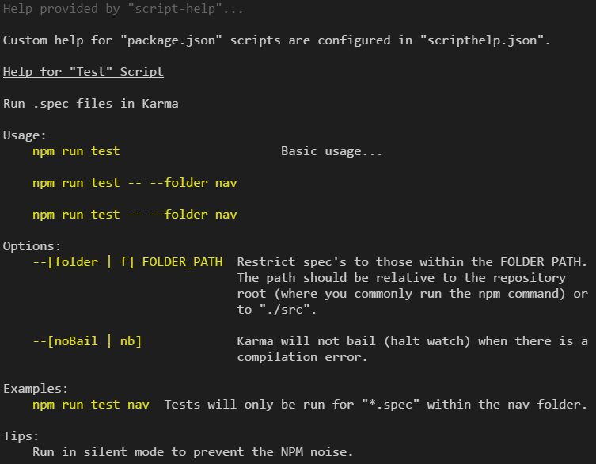

# script-help

Outputs entire or filtered npm scripts list with customizable documentation to the console.  Documentation structure is based on conventions that have been used for decades in help messages and man pages as collected at <http://docopt.org>.

[](https://codeclimate.com/github/benfeely/script-help)
[](https://travis-ci.org/benfeely/script-help)
[](https://coveralls.io/github/benfeely/script-help?branch=master)
[](https://david-dm.org/benfeely/script-help)
[](https://david-dm.org/benfeely/script-help?type=dev)



## Why

-   Highly accessible documentation
-   Unable to add comments to `package.json`
-   Can be dificult to understand intent from "scripts"
-   Explain available "options" (-s to run in silent, etc.)

## Install

```console
$ npm install --save-dev script-help
```

and add a help alias to your `package.json` scripts...
```json
{
  "scripts": {
    "help": "npm run script-help"
  }
}
```


## Usage
#### General help

```console
$ npm run help
```

#### Command help for a specific script

```console
$ npm run help test
```

### Configuration

#### Option 1: package.json

```json
{
  "scripts": {
    "help": "npm run script-help",
    "test": "DO CUSTOM STUFF && karma",
    ...
  },
  "scriptHelp": {
    "test": {
      "name": "Test",
      "description": "Run .spec files in Karma",
      "usage": [
        "npm run test"
      ],
      "options": [
        {
          "option": "--[noBail | nb]",
          "note": "Karma will not bail (halt watch) when there is a compilation error."
        }
      ]
    }
  }
}
```

#### Option 2: scripthelp.json

```json
{
  "test": {
    "name": "Test",
    "description": "Run .spec files in Karma",
    "usage": [
      "npm run test"
    ],
    "options": [
      {
        "option": "--[noBail | nb]",
        "note": "Karma will not bail (halt watch) when there is a compilation error."
      }
    ]
  }
}
```

### Sample output
#### General help

```console
$ npm run help

Help provided by "script-help"...

Running NPM Scripts

Usage:
    npm run <command> where <command> is one of:

    build, build:aot, build:aot:ci, build:aot:prod, build:ci, build:dev,
    build:prod, ci, clean, clean:compiled, clean:dll, clean:dist, clean:install,
    clean:start, clean:test-results, docs, e2e, e2e:ci, e2e:dev, e2e:int,
    e2e:prod, e2e:grid:dev, e2e:grid:int, e2e:grid:prod, e2e:live, help, i18n,
    lint, lint:fix, prebuild:dev, prebuild:prod, preclean:install,
    preclean:start, pree2e, pree2e:dev, pree2e:int, pree2e:prod, pree2e:live,
    prei18n, preserver:dev, pretest, preversion, rimraf, server, server:dev,
    server:dev:hot, server:prod, start, start:hot, start:psloc, test, tslint,
    typedoc, validate:dev, validate:prod, version, watch, watch:dev,
    watch:dev:hot, watch:prod, watch:test, webdriver-manager, webdriver:start,
    webdriver:update, webpack, webpack-dev-server

    Need more help?  Try: npm run help build or any other <command>

Getting Help for Scripts

For a detailed explanation of each <command>, set a filter or specify a specific
command.

Usage:
    npm run help <command>
    npm run help <options>

Options:
    <command>             Show detailed help for each <command> that matches the
    -f, --filter          filter.

    -k, --key             Show detailed help for the <command> matching the
                          provided key.

    -v, --version         Show the version of ScriptHelp that is being used.

Examples:
    npm run help test     Preferred
    npm run help -f buil
    npm run help -k test
```

#### Command help

```console
$ npm run help test

Help provided by "script-help"...

Help for "Test" Script

Run .spec files in Karma

Usage:
    npm run test

Options:
    --[noBail | nb]    Karma will not bail (halt watch) when there is a
                       compilation error.

Examples:
    npm run test nav   Tests will only be run for "*.spec" within the nav folder.

Tips:
    Run in silent mode to prevent the NPM noise.
```

## Contributing

In lieu of a formal style guide, take care to maintain the existing coding style. Add unit tests for any new or changed functionality. Lint and test your code.

## Release History

* 0.1.0 Initial release

# API

<!-- Generated by documentation.js. Update this documentation by updating the source code. -->
